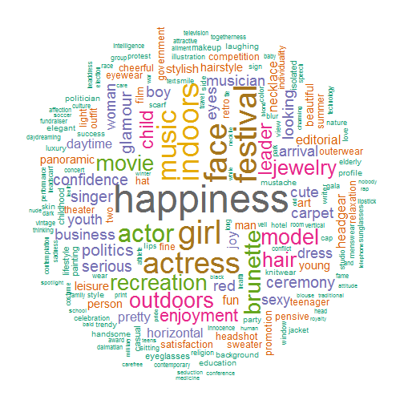
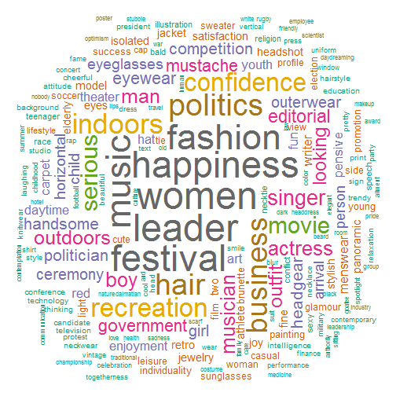

## Validation

Set working directory and merge


```r
setwd(githubdir)
setwd("clarifai_gender/validate/")

s100 <- read.csv("output-img-tag-250x100.csv")
s75  <- read.csv("output-img-tag-500x75.csv")
s50  <- read.csv("output-img-tag-750x50.csv")

g_samp <- rbind(s100, s75, s50) 
```

Subset on clarifai status = ok


```r
sg_samp <- subset(g_samp, clarifai_status=="OK")
```

Let us create a wordcloud by gender to see what we get:


```r
library(tm)
library(wordcloud)
library(RColorBrewer)

# clean tags
clean_tags <- sapply(sg_samp$tags, function(x) gsub("u'|\\[|\\]|',|'", "", x))
sg_samp$clean_tags <- unname(clean_tags)

# words by gender
fem <- paste(sg_samp$clean_tags[sg_samp$gender=="F"], collapse=" ")
mal <- paste(sg_samp$clean_tags[sg_samp$gender=="M"], collapse=" ")

# Women
dtm <- TermDocumentMatrix(VCorpus(VectorSource(fem)))
m <- as.matrix(dtm)
v <- sort(rowSums(m), decreasing=TRUE)
d <- data.frame(word = names(v), freq=v)
head(d, 10)
```

```
##                  word  freq
## people         people 49513
## portrait     portrait 49271
## one               one 43932
## adult           adult 43600
## facial         facial 41979
## expression expression 39436
## clothing     clothing 36979
## women           women 34961
## fashion       fashion 26042
## men               men 22296
```

```r
set.seed(1234)
with(d[-(1:10),], wordcloud(words = word, freq = freq, min.freq = 1,
          max.words=200, random.order=FALSE, rot.per=0.35, 
          colors=brewer.pal(8, "Dark2")))
```

 

```r
# Men
dtm <- TermDocumentMatrix(VCorpus(VectorSource(mal)))
m <- as.matrix(dtm)
v <- sort(rowSums(m), decreasing=TRUE)
d <- data.frame(word = names(v), freq=v)
head(d, 30)
```

```
##                  word  freq
## people         people 50536
## portrait     portrait 49752
## adult           adult 47430
## one               one 46460
## facial         facial 45290
## men               men 39885
## clothing     clothing 38617
## expression expression 37283
## face             face 18756
## actor           actor 17793
## women           women 16215
## leader         leader 16183
## happiness   happiness 15918
## festival     festival 15828
## music           music 15219
## fashion       fashion 15214
## politics     politics 12624
## business     business 12526
## hair             hair 12177
## indoors       indoors 11478
## recreation recreation 11271
## confidence confidence 10437
## movie           movie  9317
## serious       serious  9119
## singer         singer  8043
## actress       actress  7894
## boy               boy  7751
## musician     musician  7647
## man               man  7420
## outdoors     outdoors  7270
```

```r
set.seed(1234)
with(d[-(1:10),], wordcloud(words = word, freq = freq, min.freq = 3,
          max.words=200, random.order=FALSE, rot.per=0.35, 
          colors=brewer.pal(8, "Dark2")))
```

 

Now validate by freq of m/w: 


```r
# Load some libs
library(dplyr)
library(magrittr)

counter <- group_by(sg_samp, name) %>% 
           summarize(f = mean(predicted=="F"), 
           m = mean(predicted=="M"), 
	       fem = mean(grepl("\\bwoman\\b|girl|\\bwomen\\b", tags)), 
	       men = mean(grepl("\\bman\\b|boy|\\bmen\\b", tags)),  
	       g = mean(gender=="F"))
```


```r
with(counter, table(fem > men, g))
```

```
##        g
##           0   1
##   FALSE 647 243
##   TRUE  103 507
```
